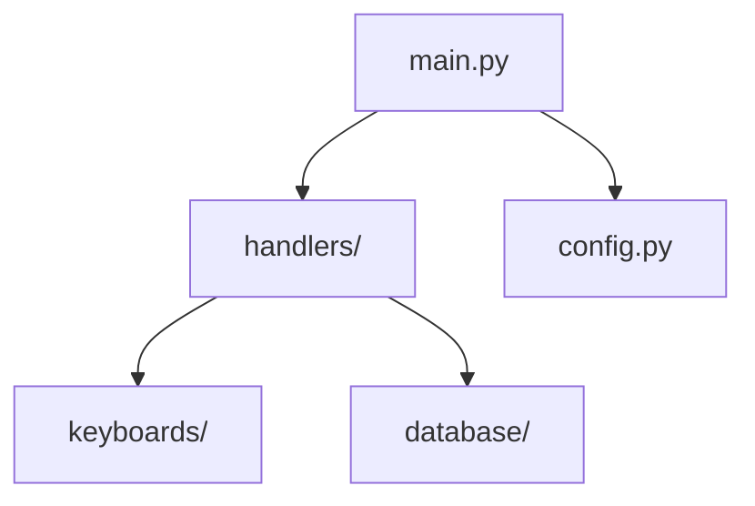

# 🚀 10 Улучшений для AI Toolkit

> Подробное описание каждой функции для неопытных пользователей

---

## 1. 🌐 Web-интерфейс (Dashboard)

### Что это?
Веб-приложение которое работает в браузере вместо терминала. Как сайт, но локальный.

### Для чего нужно?
- Удобнее чем командная строка для новичков
- Можно управлять несколькими проектами с одной страницы
- Визуализация состояния проектов (графики, иконки)
- Работает на любой ОС с браузером

### Как будет работать?
```
1. Запускаешь: ai-toolkit web
2. Открывается браузер на http://localhost:8080
3. Видишь красивый дашборд со всеми проектами
4. Кликаешь кнопки вместо ввода команд
```

### Технологии:
- FastAPI (бэкенд)
- HTMX или Vue.js (фронтенд)
- SQLite (хранение истории)

### Пример интерфейса:
```
┌──────────────────────────────────────────────────┐
│  🛠️ AI Toolkit Dashboard                    v3.0 │
├──────────────────────────────────────────────────┤
│                                                  │
│  📊 Мои проекты (5)                              │
│  ┌─────────────────┬──────────────────────────┐  │
│  │ 🤖 my_bot      │ ✅ Здоров  │ 📅 Сегодня   │  │
│  │ 🌐 webapp      │ ⚠️ Warning │ 📅 Вчера     │  │
│  │ ⚡ api_service │ ❌ Ошибка  │ 📅 3 дня     │  │
│  └─────────────────┴──────────────────────────┘  │
│                                                  │
│  [🆕 Создать] [🧹 Очистить] [📊 Отчёт]          │
│                                                  │
└──────────────────────────────────────────────────┘
```

---

## 2. 🔄 Автоматическое обновление проектов

### Что это?
Фоновый сервис который следит за твоими проектами и сам исправляет проблемы.

### Для чего нужно?
- Не нужно помнить запускать health check
- Автоматически обновляет скрипты при выходе новой версии
- Предупреждает о проблемах ДО того как они станут критическими
- Экономит время на рутинные проверки

### Как будет работать?
```
1. Регистрируешь проекты: ai-toolkit watch ./my_bot ./webapp
2. Сервис работает в фоне
3. Каждый час проверяет все проекты
4. Если находит проблему — присылает уведомление
5. Мелкие проблемы исправляет сам
```

### Что будет автоматически:
| Проблема | Действие |
|----------|----------|
| `__pycache__` накопился | Удаляет |
| Логи > 100MB | Ротирует (архивирует старые) |
| Новая версия Toolkit | Обновляет скрипты |
| venv устарел | Предупреждает |
| Секреты в коде | ALERT! |

---

## 3. 📊 Аналитика и отчёты

### Что это?
Статистика по твоим проектам в красивом виде.

### Для чего нужно?
- Понять какие проекты занимают много места
- Отследить рост размера со временем
- Сравнить проекты между собой
- Найти "мёртвые" проекты которые можно удалить

### Как будет работать?
```bash
ai-toolkit stats

📊 Статистика проектов
═══════════════════════════════════════

📁 Всего проектов: 12
💾 Общий размер: 2.3 GB
🗂️ Размер venv'ов: 1.8 GB

📈 Топ по размеру:
  1. parser_project  — 450 MB (venv: 380 MB)
  2. my_bot          — 320 MB (venv: 290 MB)
  3. webapp          — 85 MB  (venv: 50 MB)

⏰ Давно не обновлялись:
  • old_experiment — 6 месяцев назад
  • test_project   — 4 месяца назад

💡 Рекомендации:
  - Удалите 2 неактивных проекта (освободит ~200 MB)
  - Почистите логи в parser_project (45 MB)
```

### Форматы экспорта:
- Терминал (красиво)
- JSON (для автоматизации)
- HTML (для шаринга)
- Markdown (для документации)

---

## 4. 🎨 Кастомные шаблоны проектов

### Что это?
Возможность создать свой шаблон проекта и использовать его повторно.

### Для чего нужно?
- У каждого свой стиль кода
- Компании имеют свои стандарты
- Не хочется каждый раз настраивать одно и то же
- Можно поделиться шаблоном с командой

### Как будет работать?
```bash
# Создать шаблон из существующего проекта
ai-toolkit template save ./my_best_project --name "my-standard"

# Использовать шаблон
ai-toolkit create new_project --template my-standard

# Поделиться шаблоном
ai-toolkit template export my-standard --output template.zip
ai-toolkit template import template.zip
```

### Что можно настроить в шаблоне:
```yaml
# ~/.ai_toolkit/templates/my-standard/template.yaml
name: "Мой стандартный бот"
description: "Aiogram 3.x + PostgreSQL + Redis"
author: "Ваше имя"

# Структура папок
structure:
  - bot/handlers/
  - bot/keyboards/
  - bot/states/       # Добавляем FSM states
  - bot/filters/      # Кастомные фильтры
  - services/         # Бизнес-логика
  - infrastructure/   # Внешние сервисы

# Зависимости
dependencies:
  - aiogram>=3.4
  - asyncpg>=0.29     # PostgreSQL
  - redis>=5.0        # Redis
  - alembic>=1.13     # Миграции

# Переменные которые спросит при создании
variables:
  - name: bot_name
    prompt: "Название бота"
  - name: use_redis
    prompt: "Использовать Redis?"
    type: boolean
    default: true
```

---

## 5. 🔐 Менеджер секретов

### Что это?
Безопасное хранение токенов, паролей и ключей API.

### Для чего нужно?
- Не хранить пароли в .env файлах в открытом виде
- Легко переключаться между dev/staging/production
- Синхронизация секретов между машинами
- Аудит кто и когда менял секреты

### Как будет работать?
```bash
# Добавить секрет
ai-toolkit secrets set BOT_TOKEN "123456:ABC..." --project my_bot

# Получить секрет (в скрипте)
BOT_TOKEN=$(ai-toolkit secrets get BOT_TOKEN)

# Список секретов
ai-toolkit secrets list
┌────────────────┬─────────────┬──────────────┐
│ Имя            │ Проект      │ Последнее    │
├────────────────┼─────────────┼──────────────┤
│ BOT_TOKEN      │ my_bot      │ 2 дня назад  │
│ DATABASE_URL   │ my_bot      │ 1 неделю     │
│ API_KEY        │ parser      │ 1 месяц      │
└────────────────┴─────────────┴──────────────┘

# Экспорт в .env (для запуска)
ai-toolkit secrets export --project my_bot > .env
```

### Хранение:
- Локально: зашифрованный файл с мастер-паролем
- Облако (опционально): интеграция с HashiCorp Vault, AWS Secrets Manager

---

## 6. 🐳 Docker Development Environment

### Что это?
Готовые Docker-контейнеры для разработки, не только для деплоя.

### Для чего нужно?
- Одинаковое окружение у всех разработчиков
- Не нужно устанавливать Python, PostgreSQL, Redis локально
- Легко переключаться между версиями Python
- Изолированное окружение (не ломает систему)

### Как будет работать?
```bash
# Создать dev-окружение
ai-toolkit docker dev

# Запустить проект в контейнере
ai-toolkit docker run

# Открыть shell в контейнере
ai-toolkit docker shell

# Посмотреть логи
ai-toolkit docker logs
```

### Что создаётся:
```
project/
├── docker/
│   ├── dev.dockerfile       # Для разработки
│   ├── prod.dockerfile      # Для продакшена
│   └── docker-compose.dev.yml
├── .devcontainer/           # VS Code Dev Containers
│   └── devcontainer.json
└── ...
```

### Пример devcontainer.json:
```json
{
  "name": "My Bot Dev",
  "dockerComposeFile": "../docker/docker-compose.dev.yml",
  "service": "app",
  "workspaceFolder": "/app",
  "customizations": {
    "vscode": {
      "extensions": [
        "ms-python.python",
        "charliermarsh.ruff"
      ]
    }
  },
  "postCreateCommand": "pip install -e .[dev]"
}
```

---

## 7. 📝 Интерактивная документация

### Что это?
Автоматическая генерация документации из кода + интерактивные туториалы.

### Для чего нужно?
- Новички быстрее разберутся в проекте
- Документация всегда актуальна (генерируется из кода)
- AI-ассистенты лучше понимают проект
- Onboarding новых разработчиков

### Как будет работать?
```bash
# Сгенерировать документацию
ai-toolkit docs generate

# Запустить локальный сервер с документацией
ai-toolkit docs serve
# Открой http://localhost:8000

# Создать туториал
ai-toolkit docs tutorial "Как добавить команду"
```

### Что генерируется:
```
docs/
├── index.md                 # Главная страница
├── architecture.md          # Автогенерируемая схема
├── api/                     # Документация API
│   ├── handlers.md
│   └── utils.md
├── tutorials/               # Туториалы
│   └── add-command.md
└── _AI_CONTEXT.md           # Специально для AI
```

### Пример architecture.md (автогенерируемый):
```markdown
# Архитектура проекта

## Граф зависимостей



## Модули

| Модуль | Файлов | Строк кода | Описание |
|--------|--------|------------|----------|
| handlers | 5 | 320 | Обработчики команд |
| keyboards | 3 | 150 | Клавиатуры |
```

---

## 8. 🔌 Маркетплейс плагинов

### Что это?
Онлайн-каталог плагинов которые можно установить одной командой.

### Для чего нужно?
- Не изобретать велосипед
- Использовать готовые решения от сообщества
- Поделиться своими плагинами
- Стандартизация расширений

### Как будет работать?
```bash
# Поиск плагинов
ai-toolkit plugins search "telegram"
┌────────────────────┬───────────┬──────────┬────────────────────┐
│ Плагин             │ Версия    │ ⭐       │ Описание           │
├────────────────────┼───────────┼──────────┼────────────────────┤
│ telegram-premium   │ 1.2.0     │ ⭐ 45    │ Premium шаблон     │
│ telegram-payments  │ 2.0.1     │ ⭐ 32    │ Интеграция оплаты  │
│ telegram-admin     │ 1.0.5     │ ⭐ 28    │ Админ-панель       │
└────────────────────┴───────────┴──────────┴────────────────────┘

# Установка
ai-toolkit plugins install telegram-premium

# Список установленных
ai-toolkit plugins list

# Обновление
ai-toolkit plugins update telegram-premium

# Удаление
ai-toolkit plugins remove telegram-premium
```

### Создание своего плагина:
```bash
# Создать скелет плагина
ai-toolkit plugins create my-awesome-plugin

# Протестировать локально
ai-toolkit plugins test ./my-awesome-plugin

# Опубликовать
ai-toolkit plugins publish ./my-awesome-plugin
```

---

## 9. 🤖 AI-ассистент в CLI

### Что это?
Встроенный чат с AI прямо в терминале для помощи с проектом.

### Для чего нужно?
- Быстро получить ответ не выходя из терминала
- AI знает контекст твоего проекта
- Может сгенерировать код
- Объяснит ошибки

### Как будет работать?
```bash
# Спросить AI
ai-toolkit ask "Как добавить inline клавиатуру?"

🤖 AI Assistant:
Для добавления inline клавиатуры в aiogram 3.x:

1. Создай файл `bot/keyboards/inline.py`:
```python
from aiogram.types import InlineKeyboardMarkup, InlineKeyboardButton

def get_main_keyboard():
    return InlineKeyboardMarkup(inline_keyboard=[
        [InlineKeyboardButton(text="Кнопка 1", callback_data="btn1")],
        [InlineKeyboardButton(text="Кнопка 2", callback_data="btn2")],
    ])
```

2. Используй в handler:
```python
await message.answer("Выбери:", reply_markup=get_main_keyboard())
```

Создать этот файл? [Y/n]
```

### Возможности:
- Генерация кода по описанию
- Объяснение ошибок
- Рефакторинг
- Поиск по документации
- Code review

---

## 10. 📱 Мобильное приложение / Telegram бот

### Что это?
Управление проектами с телефона через Telegram бота или приложение.

### Для чего нужно?
- Проверить статус проектов на ходу
- Получать уведомления о проблемах
- Быстрые действия (перезапуск, очистка)
- Не нужен компьютер для мониторинга

### Как будет работать?
```
📱 Telegram бот @AIToolkitBot

Ты: /status
Бот: 📊 Статус проектов:
     ✅ my_bot — OK
     ⚠️ webapp — Warning: логи 45MB
     ❌ parser — Error: venv в проекте

Ты: /clean webapp
Бот: 🧹 Очищаю webapp...
     ✅ Логи очищены (освобождено 45MB)

Ты: /deploy my_bot
Бот: 🚀 Запускаю деплой my_bot...
     📦 Building...
     ✅ Deployed to production!
```

### Уведомления:
```
🔔 AI Toolkit Alert

❌ Проект: my_bot
📍 Проблема: Найден venv/ внутри проекта
💾 Размер: 380 MB
⏰ Время: 14:32

[Очистить] [Игнорировать] [Подробнее]
```

### Интеграции:
- Telegram
- Discord
- Slack
- Email

---

## 📊 Приоритеты реализации

| # | Улучшение | Сложность | Польза | Приоритет |
|---|-----------|-----------|--------|-----------|
| 1 | Web-интерфейс | 🔴 Высокая | ⭐⭐⭐⭐⭐ | 🥇 |
| 4 | Кастомные шаблоны | 🟡 Средняя | ⭐⭐⭐⭐⭐ | 🥇 |
| 8 | Маркетплейс плагинов | 🔴 Высокая | ⭐⭐⭐⭐ | 🥈 |
| 3 | Аналитика | 🟢 Низкая | ⭐⭐⭐⭐ | 🥈 |
| 7 | Документация | 🟡 Средняя | ⭐⭐⭐⭐ | 🥈 |
| 9 | AI-ассистент | 🟡 Средняя | ⭐⭐⭐⭐ | 🥉 |
| 2 | Авто-обновление | 🟡 Средняя | ⭐⭐⭐ | 🥉 |
| 5 | Менеджер секретов | 🟡 Средняя | ⭐⭐⭐ | 🥉 |
| 6 | Docker Dev Env | 🟢 Низкая | ⭐⭐⭐ | 🥉 |
| 10 | Telegram бот | 🟡 Средняя | ⭐⭐⭐ | 🥉 |

---

## 🎯 Рекомендуемый порядок реализации

### Фаза 1 (1-2 недели)
1. **Кастомные шаблоны** — самая полезная функция для повседневной работы
2. **Аналитика** — простая реализация, большая польза

### Фаза 2 (2-4 недели)
3. **Web-интерфейс** — делает инструмент доступным для новичков
4. **Документация** — улучшает понимание проекта

### Фаза 3 (1-2 месяца)
5. **Маркетплейс плагинов** — создаёт экосистему
6. **AI-ассистент** — wow-эффект

### Фаза 4 (по необходимости)
7. Авто-обновление
8. Менеджер секретов
9. Docker Dev Env
10. Telegram бот

---

## 💡 Как предложить свою идею?

1. Создай Issue на GitHub
2. Опиши проблему которую решает идея
3. Приложи примеры использования
4. Сообщество проголосует 👍

---

*Документ создан: декабрь 2024*
*Версия: 3.0.0*

